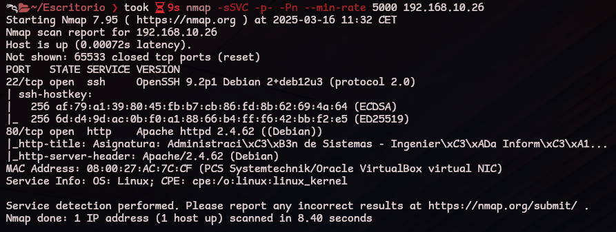

# FACULTAD

Dificultad: Fácil

Fecha: 15/03/2025

Plataforma: The Hackers Labs

Nombre: Facultad

SO: Linux

MD5: 762dfb449eafbd40e7e972893859cada.

Descargar: [The Hackers Labs - Facultad](https://thehackerslabs.com/Facultad/)

---

## Herramientas utilizadas
- 
---

## Metodología

### Reconocimiento

Empezamos haciendo un escaneo de puertos para ver cuales estan abiertos. 
```
nmap -sSVC -p- -Pn --min-rate 5000 <IP-Victima>
```


>[!NOTE]
> `-sS`: No completa la conexion entre atacante-victima lo que lo hace silencioso.
> `-V`: Deteccion de versions de los servicios
> `-C`: Detección de servicios.
> `-p-`: Escanea todos los puertos del `1` al ``65535`
> `-Pn`: No hace descubrimiento de hosts.
> `--min-rate 5000`: Tasa minima de paquetes que se enviaran por segundo.


### Explotación


### Escalada de Privilegios


### FLAG’s

La flag de usuario 


La flag de root
